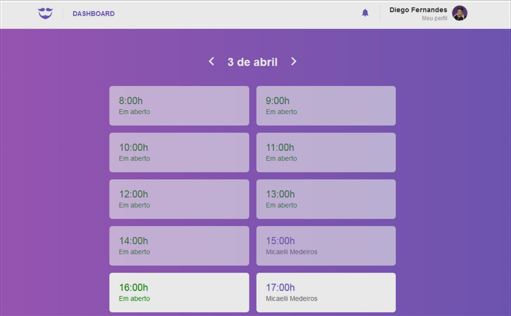
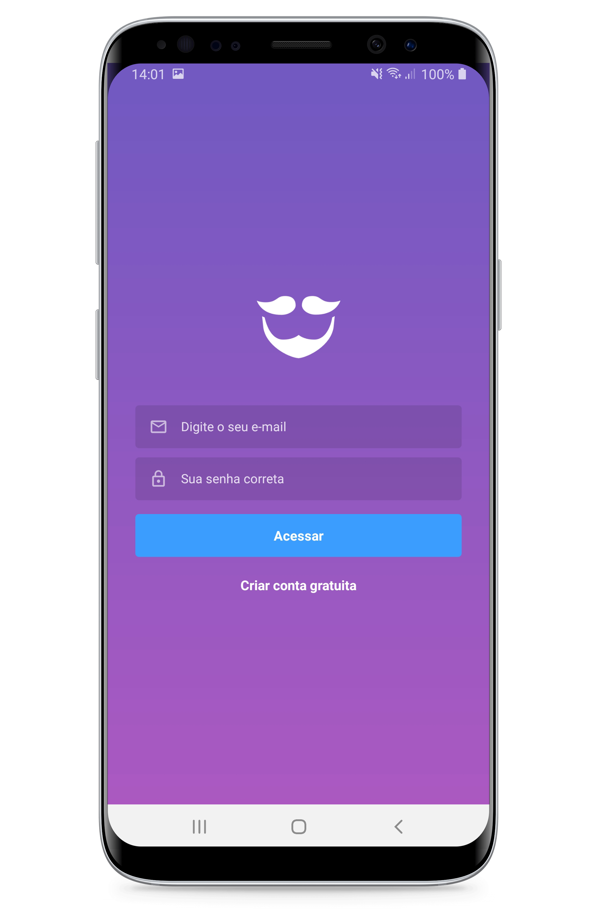

# Go Barber

  

  
  
  

  

  

:neckbeard: Projeto de conclusão do Bootcamp da Rocketseat 2019

<h1 align="center">

</h1>

### Web: (Algumas imagens ilustrativas)

### Mobile: (Algumas imagens ilustrativas)
<h1 align="center">

</h1>
